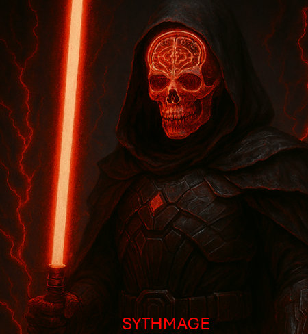

# SYTHMAGE
SYnTHetic Medical imAge using GEnerative adversarial networks 

SYTHMAGE is a PyTorch-based framework for generating synthetic medical images using a fully 3D conditional Generative Adversarial Network (cGAN). The project implements a memory-efficient 3D Pix2Pix architecture  and supports patch-based training and sliding-window whole-volume reconstruction.

The framework is designed for neuroimaging researchers interested in image enhancement, domain translation, and data harmonization. By learning the mapping between paired images, SYTHMAGE enables the generation of synthetic images from clinical scans.

Features

Fully 3D Pix2Pix GAN architecture
U-Net-based generator with skip connections
3D PatchGAN discriminator
Patch-based training for memory-efficient processing of large MRI volumes
Mixed precision training (AMP) for faster GPU execution
Instance Normalization / Group Normalization support
R1 gradient regularization for stable adversarial training
Sliding-window inference with overlap-aware weighted patch blending
Native NIfTI support through NiBabel
Integrated image quality metrics:
MSE (Mean Squared Error)
PSNR (Peak Signal-to-Noise Ratio)
SSIM (Structural Similarity Index)
FID (Fréchet Inception Distance)
Checkpoint saving and full-volume reconstruction pipeline

Applications

SYTHMAGE can be used for:
3D data translation
3D data harmonization
Data augmentation

Method Overview

The model learns a voxel-level mapping, while a discriminator simultaneously learns to distinguish real volumes from generated volumes.

Training minimizes a combination of which encourages both realistic image appearance and anatomical fidelity.
Adversarial Loss + λ × L1 Reconstruction Loss

Reconstruction Strategy

To generate complete synthetic volumes, SYTHMAGE:
Extracts overlapping 3D patches from a scan.
Predicts corresponding synthetic patches.
Blends overlapping predictions using a smooth Hamming/Gaussian weighting window.
Reconstructs a seamless full-resolution synthetic volume.

Input Data

The framework expects paired MRI datasets:

Base directory: Subject001.nii.gz, Subject002.nii.gz

Target Directory: Subject001.nii.gz, Subject002.nii.gz

where base and target scans are spatially aligned and represent the same subject.

# SYTHMAGE v1.0

## Installation
```
git clone https://github.com/dhiego22/sythmage
cd sythmage
pip install -r requirements.txt
```

## Training
```
python main.py train \
    --dir-base /base/directory \
    --dir-target /target/directory \
    --epochs 10
```

## Inference
```
python main.py infer \
    --checkpoint checkpoints/checkpoint.pt \
    --in-dir /data/directory \
    --out-dir /output/directory
```

